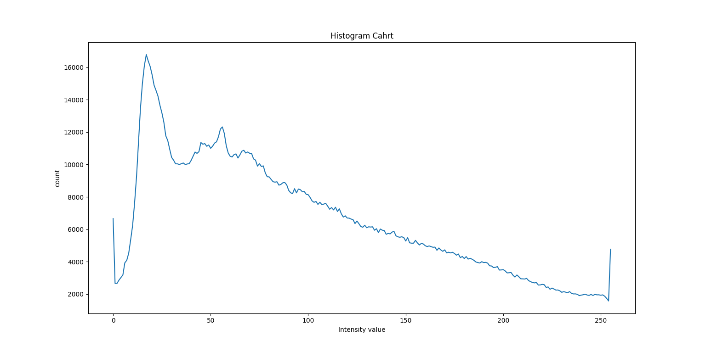

# Image Processing Projects
Image processing projects using opencv and matplotlib with python

## How To Install
Run following command:
```
pip install -r requirements.txt
```

## How To Run
Execute this command in terminal for each python file:
```
python pythonFileName
```

## Results



